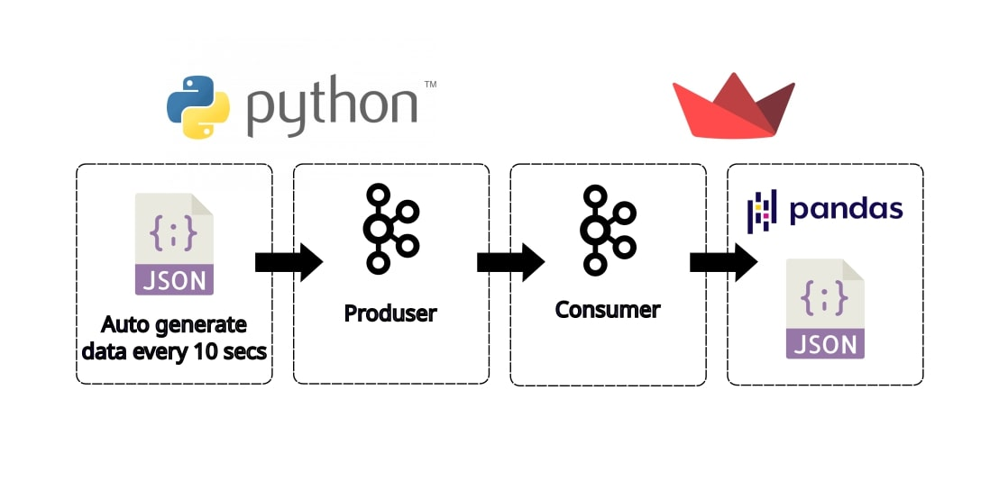
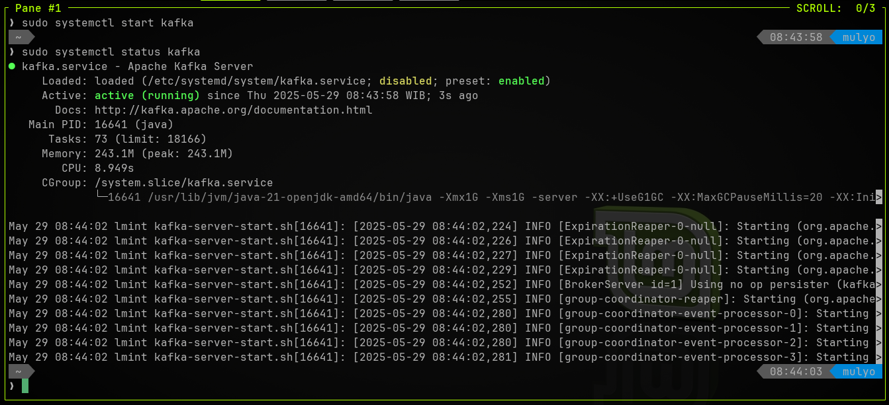
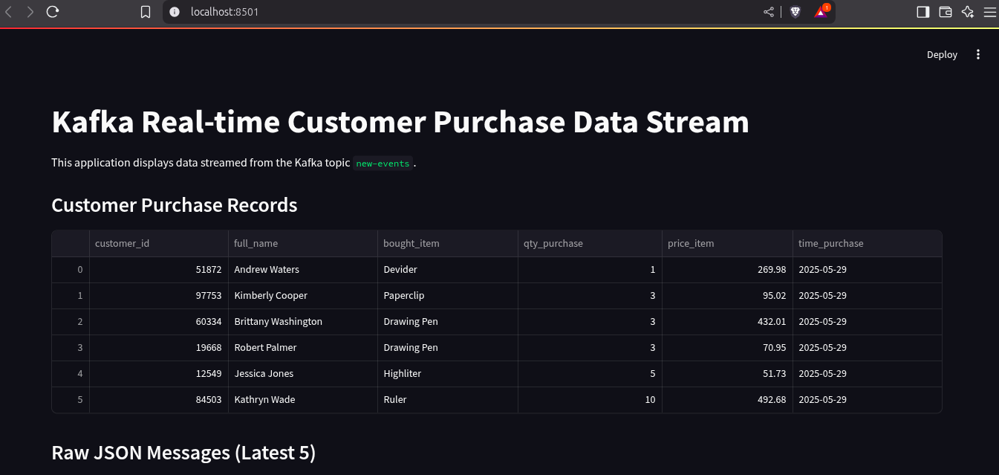

# Data_Streaming_with_Kafka

# *Overview*
Project repo to demonstrate data streaming & data consuming using Kafka. Data streaming is displayed into web in real time using Streamlit.
# *Prerequsition*
   To follow along this project need to available in your system:
   - kafka service active on localhost:9092, topic defined: new-events  # change with your topic
     ```bash
     sudo systemctl status kafka
     ```
     
# *Project FLow*
1. Data streamer
   - python3 code to autogenerate json data every 20 sec & stream into kafka-producer
     ```bash
     python3 datastreamer.py
     ```
     ```python3
     # import necesary library
     import json
     import time
     import random
     from datetime import datetime
     from kafka import KafkaProducer
     from faker import Faker
     ```
     ```python3
     # --- Configuration ---
      KAFKA_BROKER = 'localhost:9092'  # Replace with your Kafka broker address
      KAFKA_TOPIC = 'new-events'    # Replace with your desired Kafka topic name
      INTERVAL_SECONDS = 20           # in seconds
     ```
     ```python3
     # Connect to kafka broker
     producer = KafkaProducer(
            bootstrap_servers=[KAFKA_BROKER],
            value_serializer=lambda v: json.dumps(v).encode('utf-8') # Serialize dict to JSON bytes
        )
     ```
     ```python3
     # Send the JSON data to the Kafka topic
            future = producer.send(KAFKA_TOPIC, value=customer_data)
            record_metadata = future.get(timeout=10) # Block until a result is received, 10s timeout
            print(f"Sent: {json_data} to topic '{record_metadata.topic}' partition {record_metadata.partition} offset {record_metadata.offset}")
     ```
     ```python3
      # Initialize Kafka Consumer
        consumer = KafkaConsumer(
            KAFKA_TOPIC,
            bootstrap_servers=[KAFKA_BROKER],
            auto_offset_reset='latest',  # Start consuming from the latest message
            enable_auto_commit=True,
            group_id='streamlit-consumer-group',
            value_deserializer=lambda x: json.loads(x.decode('utf-8'))
        )
     ```
2. Data displaying
   - streamlit code to consume data streaming from kafka into kafka-consumer
     ```bash
     python3 kafka_display.py
     ```
     ```python3
     # import necessary library
      import streamlit as st
      import json
      from kafka import KafkaConsumer
      import pandas as pd
      import time
     ```
     ```python3
     # --- Configuration (matching data_streaming.py) ---
      KAFKA_BROKER = 'localhost:9092'  # Ensure this matches your Kafka broker address
      KAFKA_TOPIC = 'new-events'    # Ensure this matches the topic from data_streaming.py

     # --- Streamlit Application ---
      st.set_page_config(page_title="Kafka Real-time Data Stream", layout="wide")
      st.title("Kafka Real-time Customer Purchase Data Stream")
      st.markdown("This application displays data streamed from the Kafka topic `new-events`.")
     ```
     ```python3
     # Initialize Kafka Consumer
        consumer = KafkaConsumer(
            KAFKA_TOPIC,
            bootstrap_servers=[KAFKA_BROKER],
            auto_offset_reset='latest',  # Start consuming from the latest message
            enable_auto_commit=True,
            group_id='streamlit-consumer-group',
            value_deserializer=lambda x: json.loads(x.decode('utf-8'))
        )
     ```
   - using pandas dataframe to create table to be displayed into web through streamlit
     ```python3
      # Convert the list of dictionaries to a Pandas DataFrame for better display
            df = pd.DataFrame(all_data)
     ```
3. Fix the code following error messages
4. Open stramlit in browser through: localhost:8051

